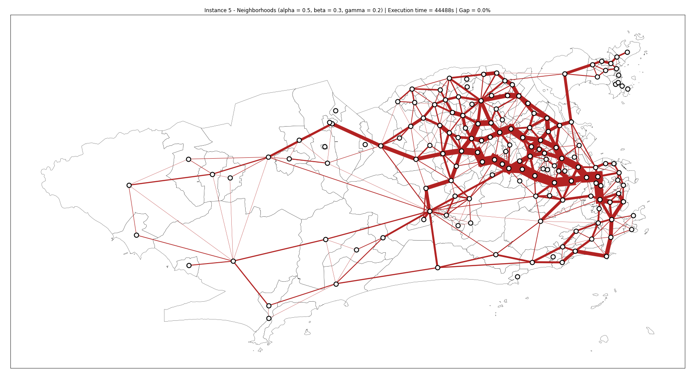

# Transit Network Optimization

This repository is an implementation of Guan et al. (2006) work titled 'Simultaneous optimization of transit line configuration and passenger line assignment' using python to generate instances and FICO Xpress Solver to solve instances.


## Dependencies

- Numpy 1.20.2
- Pandas 1.2.4
- Geopandas 0.9.0
- Matplotlib 3.4.2
- NetworkX 2.6.2
- OSMnx 1.1.1

with pip
```bash
pip install numpy pandas geopandas matplotlib networkx osmnx
```

with conda
```bash
conda install -c conda-forge numpy pandas geopandas matplotlib networkx osmnx
```

- Xpress 8.1.2 (You can download a free version of Xpress with a limited license [here](https://content.fico.com/xpress-optimization-community-license?utm_source=FICO-Community&utm_medium=app-homepage))

## Usage

Data for instances are generated in notebooks. There are 5 instances with progressively larger sizes:

- Instance 01: 9-node/8-edge toy example from Guan et al. (2006)
- Instance 02: Case study from Guan et al. (2006)*
- Instance 03: Mandl's Network from Mandl (1979)
- Instance 04: Rio de Janeiro's administrative regions
- Instance 05: Rio de Janeiro's neighborhoods

To run the optimization model, open the file "transit_network_optimization.mos" using Xpress solver and change instance and weights parameters, then run optimization.

\* Note that since demand matrices were not available from the work, we generated random matrices to solve. Solutions will differ from those presented in the paper.

\** Also note that due to the complexity of the model even the smallest instance requires a full license (sum of columns/variables and rows/restrictions exceeds 5000).


## Optimizations to Xpress Model

Our implementation of the model differs slightly from the paper. To avoid the usage of sparse matrices we preprocessed data to generate dynamic lists and remove the majority of zero elements from restrictions. Also, some values in the objective function are also preprocessed and given directly to the model.

Also, Rio de Janeiro's fare policy allows only one transfer with a single fare. We took advantage of this to preprocess data and fix all values of route-path combinations that would not be feasible (didn't contain either origin nor destination on route). This allows for a reduction of up to 72% of decision variables in y(w,r) decision matrix.


## Results

Sample results using alpha=0.5, beta=0.3 and gamma=0.2. Also, objectives are balanced to be in the same order of magnitude. Larger values of alpha (minimize total extension of routes) demand more time to optimize. Experiments were run at a Core i7 6700k @ 4.00GHz with 64 GB of RAM. A time limit of 86400s (24h) was imposed and experiments would terminate if any solutions were available. Note that this is not the case for instance 5. Even after 178872 seconds (aprox. 50h) instance 5 produced no results or bounds.

| Instance | Nodes | Edges | OD Pairs | Candidate Routes | Paths | Optimization Time |   Gap  | Selected Routes Length | Avg. Transfer per User | Avg. Distance Traveled per User | # Of Routes Selected |
|:--------:|:-----:|:-----:|:--------:|:----------------:|:-----:|:-----------------:|:------:|:----------------------:|:----------------------:|:-------------------------------:|:--------------------:|
|     1    |   9   |   8   |    72    |        36        |   10  |       0.14s       |  0.00% |          100km         |          1.44          |             23.30km             |           3          |
|     2    |   9   |   10  |    66    |        110       |   10  |       5.55s       |  0.00% |          106km         |          1.48          |             18.19km             |           4          |
|     3    |   15  |   21  |    191   |        775       |   10  |     65035.45s     |  0.00% |          87km          |          1.45          |             15.34km             |           3          |
|     4    |   32  |   73  |    794   |       1040       |   10  |       86400s      | 14.52% |         2183km         |          1.11          |             19.02km             |          30          |
|     5    |  162  |  429  |   5942   |       1952       |  1010 |      178872s      |    -   |            -           |            -           |                -                |           -          |


**Results for Instance 5 (Rio de Janeiro Neighborhoods - Unbalanced Results)**




## License
[MIT](https://choosealicense.com/licenses/mit/)
